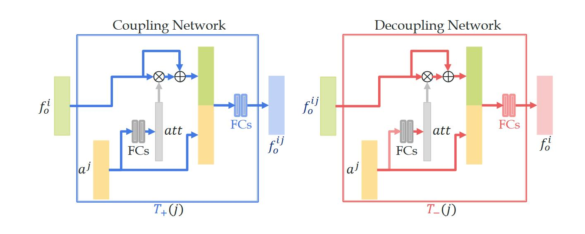

## 4.Attribute-Object Composition模型部署
### 论文链接：
-[CVPR2020版本](https://arxiv.org/abs/2004.00587)

### 代码链接：
-[tensorflow代码](https://github.com/DirtyHarryLYL/SymNet)

### 模型主要功能
该模型主要用来进行物体属性组合预测。其核心功能为四个模块，用来赋予与删除 正面与负面属性。
此四个模块皆由相同的网络组成，输入为物体特征，输出为去除或添加该属性后物体的特征，每种属性需要训练两个独立的添加与删除模块，即不同属性的模块参数也不同。

其模块设计如下。



### 主要模块：
```
# rA = remove positive attribute A
# aA = add positive attribute A
# rB = remove negative attribute B
# aB = add negative attribute B
pos_aA = self.transformer(pos_img, pos_attr_emb, True, name='CoN')
pos_aB = self.transformer(pos_img, neg_attr_emb, True, name='CoN')
pos_rA = self.transformer(pos_img, pos_attr_emb, True, name='DeCoN')
pos_rB = self.transformer(pos_img, neg_attr_emb, True, name='DeCoN')

def transformer(self, rep, v_attr, is_training, name):
    """CoN or DecoN in our paper"""
    
    with tf.variable_scope(name) as scope:
        in_dim = out_dim = self.args.rep_dim


        if not self.args.no_attention:
            attention = self.MLP(v_attr, in_dim, is_training,
                name='fc_attention', hidden_layers=self.args.fc_att)
            attention = tf.sigmoid(attention)

            rep = attention*rep + rep      # short connection

        hidden = tf.concat([rep, v_attr], axis=1)  # 512+300


        output = self.MLP(hidden, out_dim, is_training, 
            name='fc_out', hidden_layers=self.args.fc_compress)
        

    return output

def MLP(self, input_feat, output_dim, is_training, name, hidden_layers=[]):
    """multi-layer perceptron, 1 layers as default"""

    with self.basic_argscope(is_training):
        with tf.variable_scope(name) as scope:
            for i, size in enumerate(hidden_layers):
                input_feat = slim.fully_connected(input_feat, size,
                    trainable=is_training, reuse=tf.AUTO_REUSE, scope="fc_%d"%i)
                    
                if self.dropout is not None:
                    input_feat = slim.dropout(input_feat, keep_prob=self.dropout, is_training=is_training, scope='dropout_%d'%i)

            output_feat = slim.fully_connected(input_feat, output_dim,
                trainable=is_training, activation_fn=None, reuse=tf.AUTO_REUSE, scope="fc_out")
        
    return output_feat
```