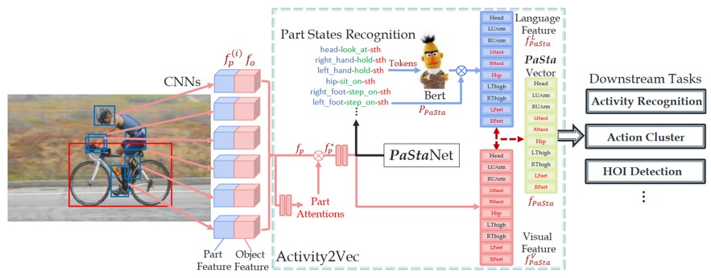

## 1.PaStaNet(HAKE)模型部署
### 论文链接：
-[PaStaNet](https://arxiv.org/abs/2004.00945)

-[HAKE2.0(期刊拓展)](https://arxiv.org/abs/2202.06851)

### 代码链接：
-[HAKE-Action(pytorch)](https://github.com/DirtyHarryLYL/HAKE-Action-Torch/tree/Activity2Vec)

-[HAKE-Action(tensorflow)](https://github.com/DirtyHarryLYL/HAKE-Action)

### 数据集链接：
-[HAKE数据集](https://github.com/DirtyHarryLYL/HAKE)

-[HAKE2.0数据集拓展(额外AVA数据)](https://github.com/DirtyHarryLYL/HAKE-AVA)

### 模型主要功能
该模型主要用于提取Body Part State特征，就是基于每个human检测框，提取10个身体部位的框架，然后对每个框架判断其行为状态（多分类任务，每一类为hand-hold-sth形式，然后提取每个部位的行为特征）

基于身体部位的行为特征也可用于预测整体的人的行为。

HAKE数据集的格式主要是将传统的HOI人物中的Human-action-object标注格式进行细粒度标注，划分为最多10个BodyPart-action-object（总计76 HAKE1.0 或93 HAKE2.0 种BodyPart-action-object组合）。注意！BodyPart并不提供额外bounding box标注，而是通过pose estimation估算出对应body part框位置。

下图为Activity2Vec特征提取框架。经过Faster RCNN提取人的检测框，又由Pose Estimation估算出body part检测框后，通过如下模块提取body part的行为特征是HAKE引擎的主要贡献。


### 环境配置：
测试环境： Python 3.7,  CUDA 10.0, Anaconda 3
 
环境配置指南：https://github.com/DirtyHarryLYL/HAKE-Action-Torch/blob/Activity2Vec/INSTALL.md

可能问题：我配置环境的过程中发现由于该环境有些古老，第三步setup编译的时候RoIPool的cuda版会编译失败，切换为cpu模式后可以暂时规避这个问题，后续可以切换最新的pytorch自带RoIPool替换原有模块。


### 预训练模型
该项目训练好的模型可以从如下链接下载：
https://github.com/DirtyHarryLYL/HAKE-Action-Torch/blob/Activity2Vec/MODEL.md

### Demo代码：
https://github.com/DirtyHarryLYL/HAKE-Action-Torch/blob/Activity2Vec/tools/demo.py


### 主要模块：

1. 人体（部位）行为识别:
 输入（Image/Video） --> （物体检测（人））human detection + （姿态估计（[AlphaPose](https://github.com/MVIG-SJTU/AlphaPose)））pose estimation --> (人体部位划分与部位框估计) body part boxes --> （部位特征提取与部位行为分类）PaSta classification


代码位置：[AlphaPose相关](https://github.com/DirtyHarryLYL/HAKE-Action-Torch/blob/Activity2Vec/tools/inference_tools/pose_inference.py), [PaSta模型相关](https://github.com/DirtyHarryLYL/HAKE-Action-Torch/blob/Activity2Vec/tools/inference_tools/pasta_inference.py), [该模块相关](https://github.com/DirtyHarryLYL/HAKE-Action-Torch/blob/Activity2Vec/tools/demo.py)
```
class Activity2Vec():
    def __init__(self, mode, cfg, logger):
        self.mode = mode
        self.cfg = cfg
        self.logger = logger
        self.vis_tool = vis_tool(cfg, mode)
        self.alphapose = AlphaPose(cfg.DEMO.DETECTOR, cfg.DEMO.YOLO_CFG, cfg.DEMO.YOLO_WEIGHT, cfg.DEMO.POSE_CFG, cfg.DEMO.POSE_WEIGHT, cfg.DEMO.TRACKER_WEIGHT, logger)
        self.pasta_model = pasta_model(cfg)
        logger.info('Loading Activity2Vec model from {}...'.format(cfg.DEMO.A2V_WEIGHT))
        
    def inference(self, image_path, image=None):
        if image is None:
            ori_image = im_read(image_path)
            alpha_image = cv2.cvtColor(ori_image, cv2.COLOR_BGR2RGB)
        else:
            ori_image = cv2.cvtColor(image, cv2.COLOR_RGB2BGR)
            alpha_image = image
        pose = self.alphapose.process(image_path, alpha_image)
        if pose is None:
            self.logger.info('[Activity2Vec] no pose result for {:s}'.format(image_path))
            vis = ori_image
            vis = self.vis_tool.draw(vis, None, None, None, None, None, None)
            return ori_image, None, vis
        else:
            try:
                pasta_image, annos = self.pasta_model.preprocess(ori_image, pose['result'])

                human_ids = []
                for human in pose['result']:
                    human_idx = int(np.array(human['idx']).flatten()[0])
                    human_ids.append(human_idx)

                annos_cpu = copy.deepcopy(annos)
                pasta_image = pasta_image.cuda(non_blocking=True)
                for key in annos:
                    if isinstance(annos[key], dict):
                        for sub_key in annos[key]:
                            annos[key][sub_key] = annos[key][sub_key].cuda()
                            annos[key][sub_key] = annos[key][sub_key].squeeze(0)
                    else:
                        annos[key] = annos[key].cuda()
                        annos[key] = annos[key].squeeze(0)
                annos['human_bboxes'] = torch.cat([torch.zeros(annos['human_bboxes'].shape[0], 1).cuda(), annos['human_bboxes']], 1)
                annos['part_bboxes'] = torch.cat([torch.zeros(annos['part_bboxes'].shape[0], annos['part_bboxes'].shape[1], 1).cuda(), annos['part_bboxes']], 2)
                
                f_pasta, p_pasta, p_verb = self.pasta_model.inference(pasta_image, annos)
                vis = ori_image

                scores = annos_cpu['human_scores'][0].numpy()[:, 0]
                bboxes = annos_cpu['human_bboxes'][0].numpy()
                keypoints = annos_cpu['keypoints'][0].numpy()

                score_filter = scores > self.cfg.DEMO.SCORE_THRES
                scores = scores[score_filter]
                bboxes = bboxes[score_filter]
                keypoints = keypoints[score_filter]
                p_pasta = p_pasta[score_filter]
                p_verb = p_verb[score_filter]
                vis = self.vis_tool.draw(vis, bboxes, keypoints, scores, p_pasta, p_verb, human_ids)

                annos_cpu['human_bboxes'] = annos_cpu['human_bboxes'].squeeze(0)
                annos_cpu['part_bboxes'] = annos_cpu['part_bboxes'].squeeze(0)
                annos_cpu['keypoints'] = annos_cpu['keypoints'].squeeze(0)
                annos_cpu['human_scores'] = annos_cpu['human_scores'].squeeze(0)
                annos_cpu['skeletons'] = annos_cpu['skeletons'].squeeze(0)
                annos_cpu['f_pasta'] = f_pasta
                annos_cpu['p_pasta'] = p_pasta
                annos_cpu['p_verb'] = p_verb
                return ori_image, annos_cpu, vis

            except Exception as e:
                self.logger.info('[Activity2Vec] unsuccess for {:s}'.format(image_path))
                self.logger.info('{:s}'.format(str(e)))
                vis = ori_image
                vis = self.vis_tool.draw(vis, None, None, None, None, None, None)
                return ori_image, None, vis
```

2. 人体（整体）行为识别: 
image/frame --> resnet --> part RoI features + pose map feature --> PaSta (Part States) recognition --> verb (whole body action) recognition 

代码位置: [该代码块位置](https://github.com/DirtyHarryLYL/HAKE-Action-Torch/blob/Activity2Vec/activity2vec/networks/pasta_net.py)
```
class pasta_res50(nn.Module):

    def __init__(self, cfg):
        super(pasta_res50, self).__init__()
        
        self.cfg             = cfg
        self.num_verbs       = cfg.DATA.NUM_VERBS
        self.num_parts       = cfg.DATA.NUM_PARTS
        self.pasta_idx2name  = cfg.DATA.PASTA_NAMES

        self.pasta_name2idx  = dict()
        self.num_pastas      = []
        for pasta_idx, part_name in enumerate(self.pasta_idx2name):
            self.pasta_name2idx[part_name] = pasta_idx
            self.num_pastas.append(cfg.DATA.NUM_PASTAS[part_name.upper()])
        
        self.num_fc          = cfg.MODEL.NUM_FC
        self.scene_dim       = 1024
        self.human_dim       = 2048
        self.roi_dim         = 1024
        self.part_agg_rule   = cfg.MODEL.PART_AGG_RULE
        self.part_agg_num    = [len(part_agg_rule) for part_agg_rule in self.part_agg_rule]
        if self.cfg.MODEL.PART_ROI_ENABLE:
            self.num_fc_parts  = [part_agg_num*self.roi_dim + self.scene_dim + self.human_dim for part_agg_num in self.part_agg_num]
        else:
            self.num_fc_parts  = [self.scene_dim + self.human_dim for part_agg_num in self.part_agg_num]
        
        if self.cfg.MODEL.POSE_MAP:
            self.num_fc_parts  = [(x + cfg.MODEL.SKELETON_DIM) for x in self.num_fc_parts]
            
        self.module_trained = cfg.MODEL.MODULE_TRAINED
        self.dropout_rate   = cfg.MODEL.DROPOUT
        self.pasta_language_matrix  = torch.from_numpy(np.load(cfg.DATA.PASTA_LANGUAGE_MATRIX_PATH)).cuda()
        self.resnet50 = resnet50_v1()
        self.resnet50.conv1.padding = 0

        ########################
        # Building the network #
        ########################

        # ResNet-style image head.
        self.image_to_head = nn.Sequential(
            # pad with 0
            nn.ConstantPad2d((0, 0, 3, 3), 0),
            nn.ConstantPad2d((3, 3, 0, 0), 0),

            # tmp_conv,
            self.resnet50.conv1,
            self.resnet50.bn1,
            self.resnet50.relu,

            # pad with 0
            nn.ConstantPad2d((0, 0, 1, 1), 0),
            nn.ConstantPad2d((1, 1, 0, 0), 0),
            
            # max pooling
            torch.nn.MaxPool2d(kernel_size=[3, 3], stride=2),

            self.resnet50.layer1,
            self.resnet50.layer2,
            self.resnet50.layer3 )

        # Human feature extractor.
        self.resnet_layer4 = self.resnet50.layer4

        # PaSta classifier.
        self.fc7_parts   = nn.ModuleList(
                                            [
                                                nn.Sequential(
                                                    nn.Linear(self.num_fc_parts[pasta_idx], self.num_fc),
                                                    nn.ReLU(inplace=True),
                                                    nn.Dropout(self.dropout_rate),
                                                    nn.Linear(self.num_fc, self.num_fc),
                                                    nn.ReLU(inplace=True),
                                                    nn.Dropout(self.dropout_rate)
                                                ) 
                                                for pasta_idx in range(len(self.pasta_idx2name))
                                            ]
                                        )

        self.part_cls_scores = nn.ModuleList(
                                                [
                                                    nn.Linear(self.num_fc, self.num_pastas[pasta_idx])
                                                    for pasta_idx in range(len(self.pasta_idx2name))
                                                ]
                                            )
        
        # Verb classifier.
        if cfg.MODEL.VERB_ONE_MORE_FC:
            self.verb_cls_scores = nn.Sequential(
                            nn.Linear(len(self.pasta_idx2name) * self.num_fc, self.num_fc),
                            nn.ReLU(inplace=True),
                            nn.Dropout(self.dropout_rate),
                            nn.Linear(self.num_fc, self.num_verbs)
                        ) 
        else:
            self.verb_cls_scores = nn.Linear(len(self.pasta_idx2name) * self.num_fc, self.num_verbs)

        ##############################
        # Freeze the useless params. #
        ##############################

        if cfg.TRAIN.FREEZE_BACKBONE:
            for p in self.image_to_head.parameters():
                p.requires_grad = False
            if cfg.TRAIN.FREEZE_RES4:
                for p in self.resnet_layer4.parameters():
                    p.requires_grad = False
            
        for pasta_idx in range(len(self.pasta_idx2name)):
            for p in self.fc7_parts[pasta_idx].parameters():
                p.requires_grad = self.pasta_idx2name[pasta_idx] in self.module_trained
            for p in self.part_cls_scores[pasta_idx].parameters():
                p.requires_grad = self.pasta_idx2name[pasta_idx] in self.module_trained

        for p in self.verb_cls_scores.parameters():
            p.requires_grad = 'verb' in self.module_trained

        ###############################################
        # Building the extractor of pose map feature. #
        ###############################################

        if cfg.MODEL.POSE_MAP:
            self.pool2_flat_pose_maps = nn.ModuleList(
                                                [
                                                    nn.Sequential(nn.Conv2d(1, 32, (5, 5), stride=(1, 1), padding=0),
                                                                  nn.ReLU(inplace=True),
                                                                  nn.MaxPool2d((2, 2)),

                                                                  nn.Conv2d(32, 16, (5, 5), stride=(1, 1), padding=0),
                                                                  nn.ReLU(inplace=True),
                                                                  nn.MaxPool2d((2, 2)))
                                                    for pasta_idx in range(len(self.pasta_idx2name))
                                                ]
                                            )
            for pasta_idx in range(len(self.pasta_idx2name)):
                for p in self.pool2_flat_pose_maps[pasta_idx].parameters():
                    p.requires_grad = self.pasta_idx2name[pasta_idx] in self.module_trained
                    

    def _crop_pool_layer(self, bottom, rois, max_pool=False):
        '''
        @input:
            bottom: [1, 1024, H, W]
            rois  : [1, N, 5]
        @output: 
            crops : [N, 1024, 7, 7]
        '''
        # implement it using stn
        # box to affine
        # input (x1,y1,x2,y2)
        """
        [  x2-x1             x1 + x2 - W + 1  ]
        [  -----      0      ---------------  ]
        [  W - 1                  W - 1       ]
        [                                     ]
        [           y2-y1    y1 + y2 - H + 1  ]
        [    0      -----    ---------------  ]
        [           H - 1         H - 1      ]
        """
        rois = rois.detach()

        x1 = (rois[:, 1::4] / 16.0).squeeze(1)
        y1 = (rois[:, 2::4] / 16.0).squeeze(1)
        x2 = (rois[:, 3::4] / 16.0).squeeze(1)
        y2 = (rois[:, 4::4] / 16.0).squeeze(1)
        height = bottom.size(2)
        width  = bottom.size(3)

        # affine theta
        theta = Variable(rois.data.new(rois.size(0), 2, 3).zero_())
        theta[:, 0, 0] = (x2 - x1) / (width - 1) 
        theta[:, 0 ,2] = (x1 + x2 - width + 1) / (width - 1) 
        theta[:, 1, 1] = (y2 - y1) / (height - 1) 
        theta[:, 1, 2] = (y1 + y2 - height + 1) / (height - 1) 

        if max_pool:
            pre_pool_size = self.cfg.POOLING_SIZE * 2
            grid = F.affine_grid(theta, torch.Size((rois.size(0), 1, pre_pool_size, pre_pool_size)), align_corners=False)

            all_roi = []
            for j in range(rois.size(0)):
                _grid = grid.narrow(0, j, 1)
                _roi_feature = F.grid_sample(bottom.view(1,bottom.size(1), bottom.size(2), bottom.size(3)), _grid, align_corners=False)
                all_roi.append(_roi_feature)
            crops = torch.cat(all_roi)
            # crops = F.grid_sample(bottom.expand(rois.size(0), bottom.size(1), bottom.size(2), bottom.size(3)), grid)
            crops = F.max_pool2d(crops, 2, 2)
        else:
            grid = F.affine_grid(theta, torch.Size((rois.size(0), 1, self.cfg.POOLING_SIZE, self.cfg.POOLING_SIZE)), align_corners=False)

            all_roi = []
            for j in range(rois.size(0)):
                _grid = grid.narrow(0, j, 1)
                _roi_feature = F.grid_sample(bottom.view(1,bottom.size(1), bottom.size(2), bottom.size(3)), _grid, align_corners=False)
                all_roi.append(_roi_feature)
            crops = torch.cat(all_roi)
            # crops = F.grid_sample(bottom.expand(rois.size(0), bottom.size(1), bottom.size(2), bottom.size(3)), grid)

        return crops

    # image/frame --> resnet --> part RoI features + pose map feature --> PaSta (Part States) recognition --> verb (whole body action) recognition
    def forward(self, image, annos):
        # Extract the feature of skeleton image.
        if self.cfg.MODEL.POSE_MAP:
            skeleton_feats = []
            for pasta_idx in range(len(self.pasta_idx2name)):
                skeleton_feat = self.pool2_flat_pose_maps[pasta_idx](annos['skeletons'])
                skeleton_feat = skeleton_feat.view(skeleton_feat.shape[0], -1)
                skeleton_feats.append(skeleton_feat)

        head = self.image_to_head(image)

        # scene/context (whole image) feature
        f_scene = torch.mean(head, [2, 3])

        # human roi feature
        f_human_roi = self._crop_pool_layer(head, annos['human_bboxes'])
        f_human = self.resnet_layer4(f_human_roi)
        f_human = torch.mean(f_human, [2, 3])
        
        #############################################################################################
        #  To simplify the model, the interacted object feature is not leveraged here.              #        
        #  You could also utilize object to further enhance the PaSta and verb recognition for HOI. #
        #  The object boxes can be obtained from your own detectors based on COCO, LVIS, FSOD, etc. #
        #  More details about HOI detection please refer to our survey repo:                        #
        #  https://github.com/DirtyHarryLYL/HOI-Learning-List                                       #
        #############################################################################################
        # object roi feature
#         f_object_roi = self._crop_pool_layer(head, annos['object_bboxes']) # detected boxes from detectors
#         f_object = self.resnet_layer4(f_object_roi)
#         f_object = torch.mean(f_object, [2, 3])

        # part roi feature
        if self.cfg.MODEL.PART_ROI_ENABLE:
            f_parts_roi = []
            for part_idx in range(self.num_parts):
                f_part_roi = torch.mean(self._crop_pool_layer(head, annos['part_bboxes'][:, part_idx, :]), [2, 3])
                f_parts_roi.append(f_part_roi)
            
            f_scene_for_part = f_scene.repeat([f_parts_roi[0].shape[0], 1])
            f_base = [f_human, f_scene_for_part]
            f_parts_agg = []
            for part_agg_rule in self.part_agg_rule:
                f_part = [f_parts_roi[part_idx] for part_idx in part_agg_rule]
                f_part = f_part + f_base
                f_part = torch.cat(f_part, 1)
                f_parts_agg.append(f_part)
        else:
            f_scene_for_part = f_scene.repeat([f_human.shape[0], 1])
            f_base = torch.cat([f_human, f_scene_for_part], 1)
            f_parts_agg = [f_base for pasta_idx in range(len(self.cfg.DATA.PASTA_NAMES))]
            
        f_parts = []
        s_parts = []
        p_parts = []

        # classify the part states
        for part_idx, f_part in enumerate(f_parts_agg):
            if self.cfg.MODEL.POSE_MAP:
                f_part_cat  = torch.cat([f_part, skeleton_feats[part_idx]], 1)
                f_part_fc7  = self.fc7_parts[part_idx](f_part_cat)
            else:
                f_part_fc7  = self.fc7_parts[part_idx](f_part)
                
            s_part  = self.part_cls_scores[part_idx](f_part_fc7)
            p_part  = torch.sigmoid(s_part)
            f_parts.append(f_part_fc7)
            s_parts.append(s_part)
            p_parts.append(p_part)
        
        f_pasta_visual = torch.cat(f_parts, 1)
        p_pasta = torch.cat(p_parts, 1)

        # classify the verbs
        s_verb = self.verb_cls_scores(f_pasta_visual)
        p_verb = torch.sigmoid(s_verb)

        f_pasta_language = torch.matmul(p_pasta, self.pasta_language_matrix)
        f_pasta = torch.cat([f_pasta_visual, f_pasta_language], 1)

        # return the pasta feature and pasta probs if in test/inference mode, 
        # else return the pasta scores for loss input.
        
        if not self.training:
            return f_pasta, p_pasta, p_verb
        else:
            return s_parts, s_verb
```

