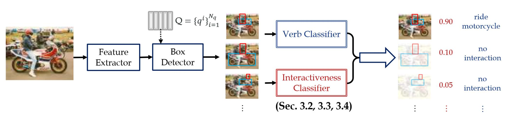
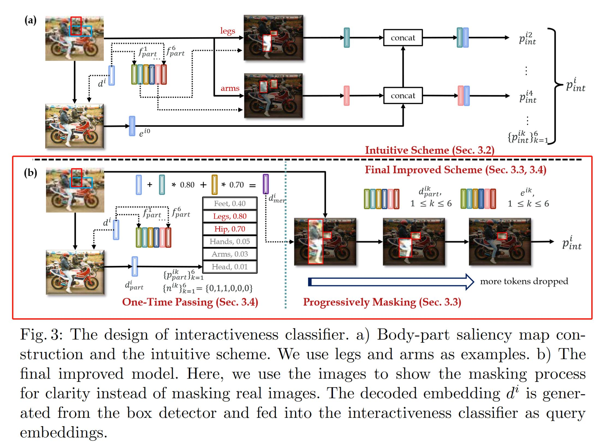

## 7. PartMap模型部署
### 论文链接：
-[ECCV2022](https://arxiv.org/pdf/2207.14192v2.pdf)

### 代码链接：
-[PartMap(pytorch)](https://github.com/enlighten0707/Body-Part-Map-for-Interactiveness)

### 模型主要功能

该文章主要提供了一个全局的Body Part交互方式。传统的HAKE引擎（PaStaNet）只通过每个目标人物自身的10个body part state来挖掘行为特征。而该文章认为还可以通过图片中其他人物的body part来挖掘额外信息。

其HOI任务框架主要为下图。


其中该文章的主要贡献为Interactiveness classifier部分。下图中的（b）解释了如何通过迭代关注显著的body part，其实就是一个把body part输入Transformer做全局交互的过程。详见下文代码。



### 环境配置：
测试环境：python 3.9，pytorch 1.9， torchvision 0.10.1


### 训练与测试指令
注意，该项目没有提供预先训练好的模型，因此必须先train再eval

Train
```
python -m torch.distributed.launch --nproc_per_node=4 main.py --config_path configs/interactiveness_train_hico_det.yml
```

Eval
```
python -m torch.distributed.launch --nproc_per_node=4 main.py --config_path configs/interactiveness_eval_hico_det.yml
```


### 主要模块：
1. 该模型基于DETR构建，基本模块为Transformer。其主要框架在./models/hoi.py下的DETR_PartMap类别。而具体的Transformer实现则在./models/transformer.py目录下，其修改自 torch.nn.Transformer。其实就是一个把body part输入Transformer做全局交互的过程。详见下文代码。

如下代码为项目的主模型：https://github.com/enlighten0707/Body-Part-Map-for-Interactiveness/blob/main/models/hoi.py
```
class DETR_PartMap(nn.Module):

    def __init__(self, backbone, transformer, num_obj_classes, num_verb_classes, num_queries, aux_loss=False, binary=False, depth=False, depth_cat=100, spmap=False, root_hum=3, ref=False, extract=False, config = None):
        super().__init__()
        
        self.config = config
        self.num_queries = num_queries
        self.transformer = transformer
        hidden_dim = transformer.d_model
        self.query_embed = nn.Embedding(num_queries, hidden_dim)
        self.obj_class_embed = nn.Linear(hidden_dim, num_obj_classes + 1)
        
        self.sub_bbox_embed = MLP(hidden_dim, hidden_dim, 4, 3)
        self.obj_bbox_embed = MLP(hidden_dim, hidden_dim, 4, 3)
        self.input_proj = nn.Conv2d(backbone.num_channels, hidden_dim, kernel_size=1)
        self.backbone = backbone
        self.aux_loss = aux_loss
        self.binary   = binary
        self.depth    = depth
        self.spmap    = spmap
        self.ref      = ref
        self.extract  = extract

        ### Interactiveness
        if self.binary:
            self.binary_class_embed = nn.Linear(hidden_dim, 2)

    def get_mask_from_query(self, outputs_coord, img_size, mask):

        outputs_obj_coord_xyxy = box_cxcywh_to_xyxy(outputs_coord) # (bz, num_query, 4), outputs_obj_class: [cx, cy, w, h], ratio
        outputs_obj_coord_xyxy = outputs_obj_coord_xyxy.detach()
        outputs_obj_coord_xyxy[..., 0] = outputs_obj_coord_xyxy[..., 0] * img_size[..., 1].unsqueeze(-1) // 32 # (bz, num_query) * (bz)
        outputs_obj_coord_xyxy[..., 1] = outputs_obj_coord_xyxy[..., 1] * img_size[..., 0].unsqueeze(-1) // 32
        outputs_obj_coord_xyxy[..., 2] = outputs_obj_coord_xyxy[..., 2] * img_size[..., 1].unsqueeze(-1) // 32
        outputs_obj_coord_xyxy[..., 3] = outputs_obj_coord_xyxy[..., 3] * img_size[..., 0].unsqueeze(-1) // 32
        outputs_obj_coord_xyxy = outputs_obj_coord_xyxy.long()
        mask_object = []
        for i in range(mask.shape[0]): # bz
            for j in range(self.num_queries):
                w1, h1, w2, h2 = outputs_obj_coord_xyxy[i, j]
                w2 = torch.minimum(w2, torch.tensor(mask.shape[2]-1).cuda().long())
                h2 = torch.minimum(h2, torch.tensor(mask.shape[1]-1).cuda().long())

                cur_mask_object = torch.zeros((mask.shape[1], mask.shape[2]), dtype=bool).cuda()
                if h1 > 0:
                    cur_mask_object = cur_mask_object.index_fill(0, torch.arange(0, h1).cuda(), True)
                if h2+1 < cur_mask_object.shape[0]:
                    cur_mask_object = cur_mask_object.index_fill(0, torch.arange(h2+1, cur_mask_object.shape[0]).cuda(), True)
                if w1 > 0:
                    cur_mask_object = cur_mask_object.index_fill(1, torch.arange(0, w1).cuda(), True)
                if w2+1 < cur_mask_object.shape[1]:
                    cur_mask_object = cur_mask_object.index_fill(1, torch.arange(w2+1, cur_mask_object.shape[1]).cuda(), True)

                mask_object.append(cur_mask_object)
        mask_object = torch.stack(mask_object, 0) # (bz * num_query, H/32, W/32)
        mask_object = mask_object.view(mask.shape[0], self.num_queries, mask_object.shape[-2], mask_object.shape[-1])
        return mask_object

    def forward(self, samples: NestedTensor, depth: NestedTensor = None, spmap: NestedTensor = None, mask_part = None, img_size=None, targets=None):
        if not isinstance(samples, NestedTensor):
            samples = nested_tensor_from_tensor_list(samples) # samples: [bz, 3, H, W], [bz, H, W]

        features, pos = self.backbone(samples) # pos: (bz, 256, H/32, W/32)
        src, mask = features[-1].decompose() # src: (bz, 2048, H/32, W/32), mask: (bz, H/32, W/32)
        assert mask is not None
        
        if mask_part is not None:
            mask_part = mask_part.decompose()[0] # mask_part: (bz, 6=num_part, H/32, W/32)
            mask_part = mask_part[..., :mask.shape[1], :mask.shape[2]] # mask_part: (bz, 6=num_part, H/32, W/32)

        # box decoder
        hs_box, memory = self.transformer.forward_box(self.input_proj(src), mask, self.query_embed.weight, pos[-1]) # hs_obj, hs_hum, hs_verb: (6=num_decoder, bz, 64=num_query, 256)
        hs_obj = hs_hum = hs_box
        outputs_obj_class  = self.obj_class_embed(hs_obj) # (6, bz, num_query, 80)
        outputs_obj_coord  = self.obj_bbox_embed(hs_obj).sigmoid() # (6, bz, num_query, 4)
        outputs_sub_coord  = self.sub_bbox_embed(hs_hum).sigmoid() # (6, bz, num_query, 4)

        # get mask from query
        mask_object = self.get_mask_from_query(outputs_obj_coord[-1], img_size, mask)
        mask_human = self.get_mask_from_query(outputs_sub_coord[-1], img_size, mask)

        bs = src.shape[0]
        matched_6v = torch.zeros((bs, self.num_queries, 6)).cuda() # (bz, num_query, 6)

        # binary_decoder
        if self.binary:
            hs_binary, util_value, binary_decoder_weight = self.transformer.forward_binary(memory, mask, pos[-1], hs_box, \
                                            mask_part, mask_object, mask_human, self.num_queries, matched_6v)
            
        # prediction
        if "verb_labels" in self.config.losses:
             outputs_verb_class = self.verb_class_embed(hs_binary)
        else:
            outputs_verb_class = torch.zeros((6, pos[-1].shape[0], self.num_queries, self.config.num_verb_classes)).cuda()
        out = {'pred_obj_logits': outputs_obj_class[-1], 'pred_verb_logits': outputs_verb_class[-1],
               'pred_sub_boxes': outputs_sub_coord[-1], 'pred_obj_boxes': outputs_obj_coord[-1],}    
        outputs_binary_class, outputs_obj_class_ref, outputs_obj_coord_ref = None, None, None

        pred_binary_logits = None
        if self.binary:
            out["binary_decoder_weight"] = binary_decoder_weight
            pred_part_binary = util_value # (bz, num_query, 6, 2)
            pred_binary_logits = self.binary_class_embed(hs_binary) # (1, bz, num_query, 256) -> (1, bz, num_query, 2)
            out['pred_binary_logits'] = pred_binary_logits[-1] # (bz, num_query, 2)
            out['pred_part_binary_logits'] = pred_part_binary.permute(2, 0, 1, 3) # (6, bz, num_query, 2)

        if self.aux_loss:
            out['aux_outputs'] = self._set_aux_loss(outputs_obj_class, outputs_sub_coord, outputs_obj_coord, pred_binary_logits, outputs_verb_class)
        return out
    
    @torch.jit.unused
    def _set_aux_loss(self, outputs_obj_class, outputs_sub_coord, outputs_obj_coord, outputs_binary_class=None, outputs_verb_class=None):
        # this is a workaround to make torchscript happy, as torchscript
        # doesn't support dictionary with non-homogeneous values, such
        # as a dict having both a Tensor and a list.

        return [{'pred_obj_logits': a,  'pred_sub_boxes': c, 'pred_obj_boxes': d, 'pred_binary_logits': e, 'pred_verb_logits':f}
                for a, c, d, e, f in zip_longest(outputs_obj_class[:-1], 
                                outputs_sub_coord[:-1], outputs_obj_coord[:-1], outputs_binary_class[:-1], outputs_verb_class[:-1])]

class MLP(nn.Module):
    """ Very simple multi-layer perceptron (also called FFN)"""

    def __init__(self, input_dim, hidden_dim, output_dim, num_layers):
        super().__init__()
        self.num_layers = num_layers
        h = [hidden_dim] * (num_layers - 1)
        self.layers = nn.ModuleList(nn.Linear(n, k) for n, k in zip([input_dim] + h, h + [output_dim]))

    def forward(self, x):
        for i, layer in enumerate(self.layers):
            x = F.relu(layer(x)) if i < self.num_layers - 1 else layer(x)
        return x
```

其主要的Transformer类的实现为如下代码：
```
class MLP(nn.Module):
    """ Very simple multi-layer perceptron (also called FFN)"""

    def __init__(self, input_dim, hidden_dim, output_dim, num_layers):
        super().__init__()
        self.num_layers = num_layers
        h = [hidden_dim] * (num_layers - 1)
        self.layers = nn.ModuleList(nn.Linear(n, k) for n, k in zip([input_dim] + h, h + [output_dim]))

    def forward(self, x):
        for i, layer in enumerate(self.layers):
            x = F.relu(layer(x)) if i < self.num_layers - 1 else layer(x)
        return x


class Transformer_PartMap(nn.Module):

    def __init__(self, d_model=512, nhead=8, num_encoder_layers=6,
                 num_decoder_layers_box=3, num_decoder_layers_verb=3, dim_feedforward=2048, dropout=0.1,
                 activation="relu", normalize_before=False,
                 return_intermediate_dec=False, config= None):
        super().__init__()

        self.config = config
        encoder_layer = TransformerEncoderLayer(d_model, nhead, dim_feedforward,
                                                dropout, activation, normalize_before)
        encoder_norm = nn.LayerNorm(d_model) if normalize_before else None
        self.encoder = TransformerEncoder(encoder_layer, num_encoder_layers, encoder_norm)

        decoder_layer_box = TransformerDecoderLayer(d_model, nhead, dim_feedforward,
                                                dropout, activation, normalize_before)
        decoder_box_norm = nn.LayerNorm(d_model)
        self.box_decoder = TransformerDecoder(decoder_layer_box, num_decoder_layers_box, decoder_box_norm, return_intermediate=return_intermediate_dec)

        decoder_layer_verb = TransformerDecoderLayer(d_model, nhead, dim_feedforward,
                                                dropout, activation, normalize_before)
        decoder_verb_norm = nn.LayerNorm(d_model)

        self.binary_decoder_1 = TransformerDecoder(decoder_layer_verb, 1, decoder_verb_norm, return_intermediate=return_intermediate_dec)
        self.binary_decoder_2 = TransformerDecoder(decoder_layer_verb, 1, decoder_verb_norm, return_intermediate=return_intermediate_dec)
        self.binary_decoder_3 = TransformerDecoder(decoder_layer_verb, 1, decoder_verb_norm, return_intermediate=return_intermediate_dec)
        self.binary_decoder_4 = TransformerDecoder(decoder_layer_verb, 1, decoder_verb_norm, return_intermediate=return_intermediate_dec)
        self.classifier_6v = MLP(d_model, d_model, 12, 2)
        self.binary_weight = torch.nn.Parameter(torch.randn((6, d_model)), requires_grad=True)
        self.binary_bias = torch.nn.Parameter(torch.randn((6, d_model)), requires_grad=True)

        self._reset_parameters()

        self.d_model = d_model
        self.nhead = nhead
        self.num_decoder_layers_verb = num_decoder_layers_verb

    def _reset_parameters(self):
        for p in self.parameters():
            if p.dim() > 1:
                nn.init.xavier_uniform_(p)

    def forward_box(self, src, mask, query_embed, pos_embed):
        # flatten NxCxHxW to HWxNxC
        bs, c, h, w = src.shape
        src = src.flatten(2).permute(2, 0, 1)
        pos_embed = pos_embed.flatten(2).permute(2, 0, 1)
        query_embed = query_embed.unsqueeze(1).repeat(1, bs, 1)
        mask = mask.flatten(1)
        
        memory = self.encoder(src, src_key_padding_mask=mask, pos=pos_embed)
        
        tgt_box  = torch.zeros_like(query_embed)
        out_box, box_decoder_weight  = self.box_decoder(tgt_box, memory, memory_key_padding_mask=mask, pos=pos_embed, query_pos=query_embed)
        
        return out_box.transpose(1, 2), memory # out_box (6=num_decoder, bz, 64=num_query, 256=dim)
    
    def forward_binary(self, memory, mask, pos_embed, out_box,
                        mask_part=None, mask_object=None, mask_human=None, num_queries=None, matched_6v=None):
        
        pos_embed = pos_embed.flatten(2).permute(2, 0, 1)
        mask = mask.flatten(1)
        verb_query = out_box[-1] # (bz, num_query, dim)
        verb_query = verb_query.permute(1, 0, 2) # (num_query, bz, dim)
        tgt_verb   = torch.zeros_like(verb_query)
            
        out_binary, _ = self.binary_decoder_1(tgt_verb, 
                                            memory, pos=pos_embed, 
                                            query_pos=verb_query,
                                            memory_key_padding_mask=mask,
                                            ) # out_binary: (1, num_query, bz, dim), binary_decoder_weight: (1, bz, 64, H/32*W/32)
        ## mask matrix(bz, H/32*W/32)
        mask_part = mask_part.flatten(2, 3) # mask_part (bz, 6=num_part, H/32*W/32)
        mask_object = mask_object.flatten(2, 3) # mask_object (bz, num_query, H/32, W/32) -> (bz, num_query, H/32*W/32)
        mask_human = mask_human.flatten(2, 3)

        ## filter&merge
        score_part = self.classifier_6v(out_binary[-1].transpose(0, 1)) # (bz, num_query, dim) -> (bz, num_query, 12)
        score_part = score_part.view(*score_part.shape[:2], 6, 2) # (bz, num_query, 6, 2)
        score_part_sel = F.softmax(score_part, -1)[..., 1] # (bz, num_query, 6)
            
        _, index_max = score_part_sel.topk(3, dim=-1, largest = True) # get top_k part
        mask_select_part = []
        for bs in range(mask_part.shape[0]):
            mask_select_part.append(torch.stack([mask_part[bs][index_max[bs, :, j]] for j in range(index_max.shape[-1])], 0)) # (num_query, 6)
        mask_select_part = torch.stack(mask_select_part, 0)
        mask_part_dynamic = mask_select_part.min(dim=1)[0]
        # print("mask_part_dynamic",(~mask_part_dynamic).sum(-1)[0])
        mask_part_dynamic = torch.minimum(mask_part_dynamic, mask_object)

        part_queries = []
        for part_id in range(6):
            part_query = torch.einsum("ijk,k->ijk", verb_query, self.binary_weight[part_id]) + self.binary_bias[part_id] # (num_query, bz, dim), (dim) -> (num_query, bz, dim)
            part_queries.append(part_query)
        part_queries = torch.stack(part_queries, 0) # (6, num_query, bz, dim)
        score_part_softmax = score_part_sel
        part_query = torch.einsum("ijkl,kji->jkl", part_queries, score_part_softmax) # (num_query, bz, 256)
        part_query += verb_query


        ## progressively masking
        # the k-th body-part of the detected human, and the whole body of the other humans in the image
        mask_other_human = ~(mask_part.min(1)[0].unsqueeze(1).expand(-1, num_queries, -1) ^ mask_human)
        mask_2 = torch.minimum(mask_other_human, mask_part_dynamic)
        # print("mask_2",(~mask_2).sum(-1)[0])
        mask_2 = mask_2.unsqueeze(1).expand(-1, self.nhead, -1, -1).flatten(0, 1)
        out_binary, binary_decoder_weight_2 = self.binary_decoder_2(
                                            tgt_verb,
                                            memory, pos=pos_embed, 
                                            query_pos=part_query,
                                            memory_key_padding_mask=mask,
                                            memory_mask=mask_2,
                                            )
        # the k-th body-part from all persons in the image
        mask_3 = mask_part_dynamic
        # print("mask_3",(~mask_3).sum(-1)[0])
        mask_3 = mask_3.unsqueeze(1).expand(-1, self.nhead, -1, -1).flatten(0, 1) # (bz*num_heads, num_query, H/32*W/32)
        out_binary, binary_decoder_weight_3 = self.binary_decoder_3(out_binary[-1], 
                                            memory, pos=pos_embed, 
                                            query_pos=part_query,
                                            memory_key_padding_mask=mask,
                                            memory_mask=mask_3,
                                            )
        # the k-th body-part of the targeted person
        out_binary, binary_decoder_weight_4 = self.binary_decoder_4(out_binary[-1], 
                                            memory, pos=pos_embed, 
                                            query_pos=part_query,
                                            memory_key_padding_mask=mask,
                                            memory_mask=mask_3,
                                            )
        out_binary = out_binary.transpose(1, 2)

        return out_binary, score_part,\
            torch.stack([binary_decoder_weight_2, binary_decoder_weight_3, binary_decoder_weight_4], 0)

```